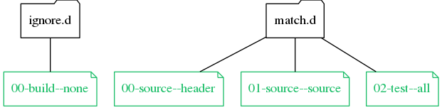

🕵🏻‍ Extensible filesystem observation with callbacks

... for Linux, OS X, FreeBSD, Windows

**mulle-match** matches filenames against a set of .gitignore like patternfiles
to categorize files according to their filenames and location.


Executable      | Description
----------------|--------------------------------
`mulle-match`   | Match filename according to .gitignore like patternfiles


## Install

See [mulle-sde-developer](//github.com/mulle-sde/mulle-sde-developer) how
to install mulle-sde.


## Commands


### mulle-match patternfile

A *patternfile* is made up of one or more *patterns*. It is quite like a
`.gitignore` file, with the same semantics for negation.


Example:

```
# match .c .h and .cpp files
*.c
*.h
*.cpp

# ignore backup files though
!*~.*
```

A *patternfile* resides in either the `skip.d` folder or the
`match.d` folder. It's filename is composed of three segments.
The first digits-only segment is there to proritize patternfiles. Lower
numbers are matched before higher numbers (`ls` sorting)
. The second segment gives the type of the file. And the last segment
the category of the file. A type is required, a category is optional.



If a *patternfile* of the `ignore.d` folder matches, the matching has failed.
On the other hand, if a *patternfile* of the `match.d` folder matches, the
matching has succeeded. *patternfiles* are matched in sort order of their
filename.

> The [Wiki](https://github.com/mulle-sde/mulle-monitor/wiki)
> explains this in much more detail.

Add a *patternfile* to select PNG files. We give it a type "hello":

```
echo "*.png" > pattern.txt
mulle-match -e patternfile install hello pattern.txt
```

You can optionally specify a *category* for the patternfile:

```
mulle-match -e patternfile install --category special hello pattern.txt
```

It may be useful, especially in conjunction with `mulle-match find`,
that large and changing folders like `.git` and `build` are ignored. Install the following patternfile into the `ignore.d` folder with `-i`:

```
echo ".git/" > pattern.txt
echo "build/" >> pattern.txt
mulle-match -e patternfile install -i folders pattern.txt
```


Remove a *patternfile*:

```
mulle-match -e patternfile remove hello
```

List all *patternfiles*:

```
mulle-match -e patternfile list
```


### mulle-match match

To test your installed *patternfile* you can use `mulle-match match`. It
will output the patternfile name if one matches.

```
mulle-match -e match pix/foo.png
```

You can also test individual *patterns* using the `--pattern` option:

```
mulle-match -e match --pattern '*.png' pix/foo.png
```


### mulle-match list

This command lists the filenames that match *patternfiles*.
You can decide which *patternfile* should be used by supplying an optional
filter.

This example lists all the files, that pass through *patternfiles* of type
"hello":

```
mulle-match -e list --match-filter "hello"
```


