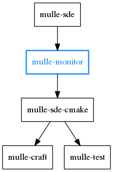
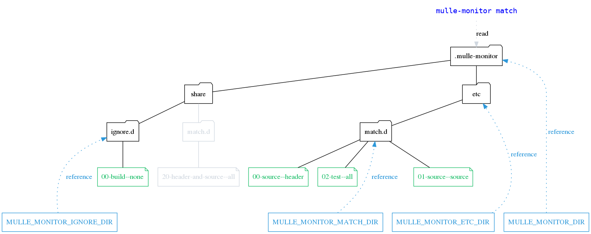
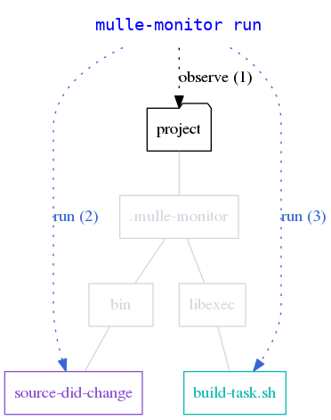

🕵🏻‍ Extensible filesystem observation with callbacks 

... for Linux, OS X, FreeBSD, Windows


**mulle-monitor** watches for the creation, deletion and updates of files
in the working directory (and its sub-directories) using
[fswatch](https://github.com/emcrisostomo/fswatch) or
[inotifywait](https://linux.die.net/man/1/inotifywait). It then
matches those filenames against a set of *patternfiles* to determine the
appropriate executable to call. 





## Install


OS          | Command
------------|------------------------------------
macos       | `brew install mulle-kybernetik/software/mulle-monitor`
other       | Install prerequisite [mulle-bashfunctions](//github.com/mulle-nat/mulle-bashfunctions) first. Then `./install.sh`


Executable      | Description
----------------|--------------------------------
`mulle-monitor` | Observe changes in filesystem and react to them


## Commands


### mulle-monitor patternfile

A *patternfile* is made up of one or more *patterns*. It is quite like a 
`.gitignore` file, with the same semantics for negation. 


Example:

```
# match .c .h and .cpp files
*.c
*.h
*.cpp

# ignore backup files though
!*~.*
```

> The matching is a bit less sophisticated than .gitignore though, since
> a `*` matches everything.

A *patternfile* resides in either the `ignore.d` folder or the `match.d` 
folder. 



If a *patternfile* of the `ignore.d` folder matches, the matching has failed. 
On the other hand, if a *patternfile* of the `match.d` folder matches, the 
matching has succeeded. *patternfiles* are matched in sort order of their
filename.

> The [Wiki](https://github.com/mulle-sde/mulle-monitor/wiki) 
> explains this in much more detail.

Add a *patternfile* to select the *callback* "hello":

```
echo "*.png" > pattern.txt
mulle-monitor -e patternfile install hello pattern.txt
```

You can optionally specify a category for the patternfile, which will be 
forwarded to the callback:

```
mulle-monitor -e patternfile install --category special hello pattern.txt
```

Remove a *patternfile*:

```
mulle-monitor -e patternfile uninstall hello
```

List all *patternfiles*:

```
mulle-monitor -e patternfile list
```

> Note: Due to  caching of compiled patternfiles, you need
> to restart `mulle-monitor run` to pick up edits to a *patternfile*.


### mulle-monitor match

To test your *patternfiles* you can use `mulle-monitor match`. It will output 
the *callback* name if a file matches.

```
mulle-monitor -e match pix/foo.png
```

You can also test individual *patterns* using the `--pattern` option:

```
mulle-monitor -e match --pattern '*.png' pix/foo.png
```


### mulle-monitor find

This is a facility to retrieve all filenames that match *patternfiles*. You can 
decide which *patternfile* should be used by supplying an optional filter.

This example lists all the files, that pass through *patternfiles* of type 
"hello":

```
mulle-monitor -e find --match-filter "hello"
```


### mulle-monitor callback


Add a *callback* for "hello":

```
cat <<EOF > my-callback.py
#!/usr/bin/env python
print "world"
EOF
mulle-monitor -e callback install hello my-callback.py
```

Remove a *callback*:

```
mulle-monitor -e callback uninstall hello
```

List all *callbacks*:

```
mulle-monitor -e callback list
```


### mulle-monitor task

A *task* is a bash script plugin. It needs to define a function 
`task_<task>_main` to be a usable task plugin. 

Add a sourcable shell script as a for a task "world":

```
cat <<EOF > my-plugin.sh
task_world_main()
{
   echo "VfL Bochum 1848"
}
EOF
mulle-monitor -e task install world "my-plugin.sh"
```

Remove a *task* named "world":

```
mulle-monitor -e task uninstall world 
```


List all *tasks*:

```
mulle-monitor -e task list
```


### mulle-monitor run

```
mulle-monitor -e run
```

`mulle-monitor run` observes the working directory and waits for filesystem 
events.



If an incoming event can not be categorized as one of these three event types:
**create**, **update**, **delete** it is ignored.

The filename that generated the event is then classified using **matching**
(see `mulle-monitor patternfile` for more information). 
The result of this classification is the name of the *callback*. 

The *callback* will now be executed. As arguments it gets the event type 
(e.g. **update**), the filename, and the category of the matching *patternfile*. 

The *callback* may produce a *task* name, by echoing it to stdout. If a 
*task* name is produced, then this *task* is loaded by **mulle-monitor** 
and executed. 

> The [Wiki](https://github.com/mulle-sde/mulle-monitor/wiki) 
> explains this also in much more detail.

> **mulle-monitor** comes with no predefined *patternfiles*, *callbacks*, or 
> *tasks*.
